# Hi there, I'm Manabu! 👋

### 👨‍💻 Mobile & Web Engineer | Former Project Manager

I am a software engineer based in **Colorado, USA**, currently specializing in Android development.
I love building UI/UX libraries that make developers' lives easier.

### 🔭 Current Focus & Active Open Source Projects

I am currently maintaining and improving:

* 🐛 **[DebugOverlay-Android](https://github.com/Manabu-GT/DebugOverlay-Android)**
   A zero-configuration runtime diagnostics overlay for Android fully written in Kotlin + Jetpack Compose. It surfaces real-time performance metrics (CPU, memory, FPS), **Logcat** and **Network** logging panels, and **one-tap bug reports** — all without requiring dangerous permissions.

* 📍 **[android-mock-location-mcp](https://github.com/Manabu-GT/android-mock-location-mcp)**
   An MCP server + Android agent for controlling device GPS location during development and testing.

* ⚔️ **[SamuraiTyping](https://INSERT_URL_HERE)**
   Free touch typing for kids ages 7+. No ads, no accounts, no tracking. A fun Japanese warrior-themed app with 9 levels — from Apprentice to Legend. Built by a parent.

### 📊 GitHub Stats

  
  

<!--
**Manabu-GT/Manabu-GT** is a ✨ _special_ ✨ repository because its `README.md` (this file) appears on your GitHub profile.

Here are some ideas to get you started:

- 🔭 I’m currently working on ...
- 🌱 I’m currently learning ...
- 👯 I’m looking to collaborate on ...
- 🤔 I’m looking for help with ...
- 💬 Ask me about ...
- 📫 How to reach me: ...
- 😄 Pronouns: ...
- ⚡ Fun fact: ...
-->
